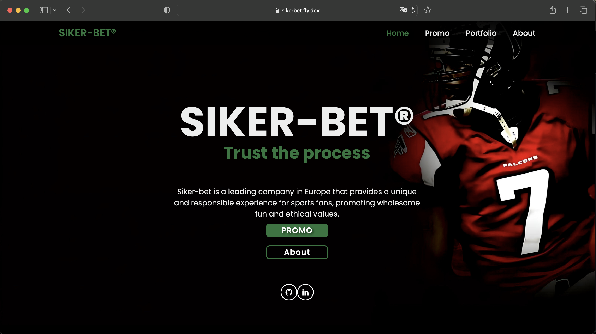

# Siker-bet - Proyecto Machine Learning

  

  <a href="https://sikerbet.fly.dev">SIKER-BET®</a>

👆🏼👆🏼👆🏼

 

> _"Tu camino hacia el éxito en las apuestas deportivas"_

Siker-bet es una empresa innovadora que lleva la emoción de los deportes estadounidenses, incluyendo NHL, NFL, NBA y MLB, a Europa. Nuestra plataforma tiene como objetivo aprovechar el creciente interés en estos deportes y ofrece una experiencia única y personalizada de apuestas deportivas para los aficionados.

## Acerca de Siker-bet

El nombre "Siker" tiene un significado especial, ya que proviene del albanés y se traduce como "éxito". En Siker-bet, estamos apasionados por empoderar a nuestros clientes con las herramientas necesarias para lograr el éxito en sus actividades de apuestas deportivas. Nuestro compromiso es ofrecer un enfoque distintivo respaldado por tecnología de vanguardia.

## Características destacadas

- Modelo avanzado de aprendizaje automático para pronósticos inteligentes en NFL.
- Análisis meticuloso de datos históricos, estadísticas de jugadores y tendencias de equipos.
- Entorno seguro y amigable para explorar una amplia gama de opciones de apuestas.

## Cómo Empezar

Si eres un apasionado aficionado de los deportes estadounidenses y deseas elevar tu experiencia de apuestas, Siker-bet es tu mejor aliado. Únete a nosotros ahora y experimenta el poder de la inteligencia artificial aplicada a las apuestas deportivas. Prepárate para alcanzar el éxito con Siker-bet.

